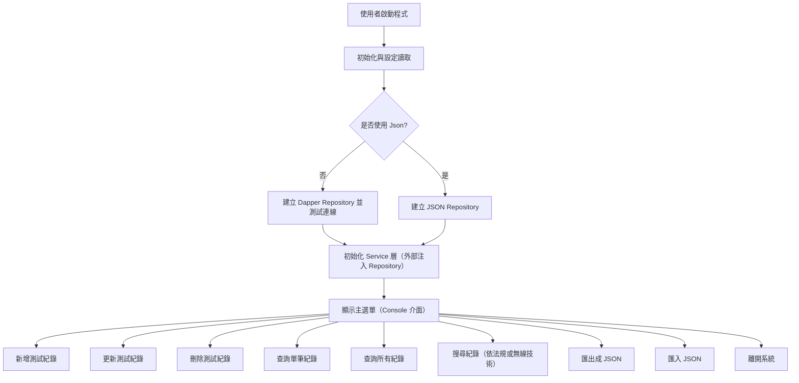
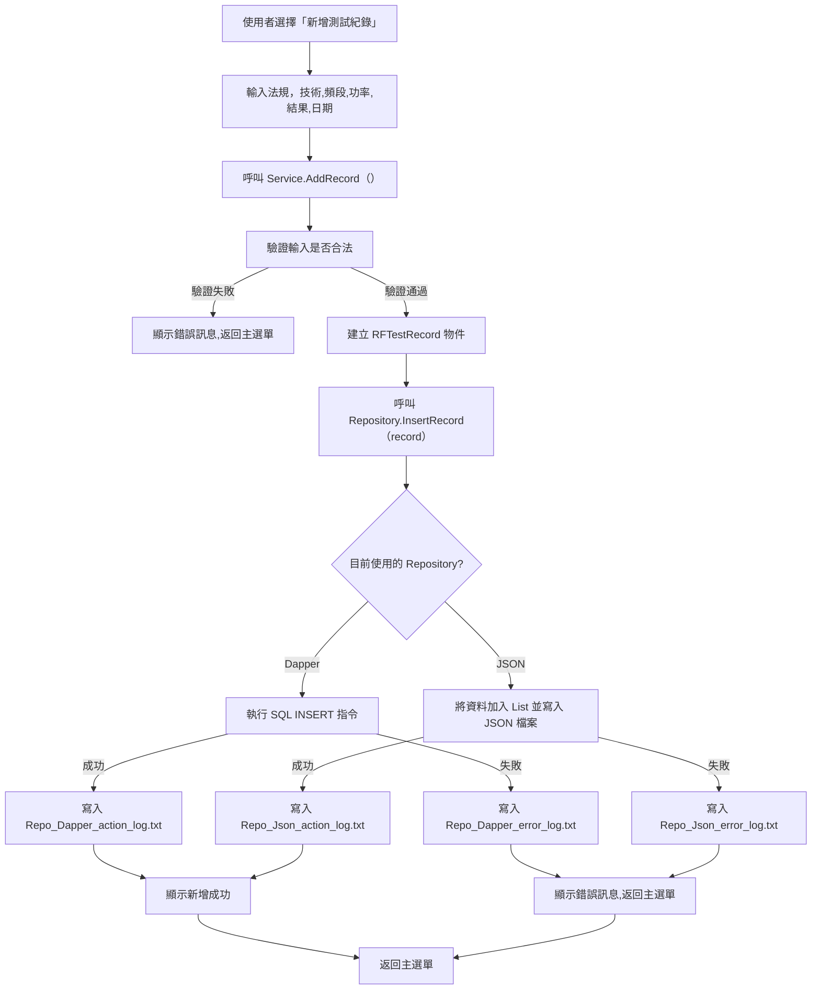
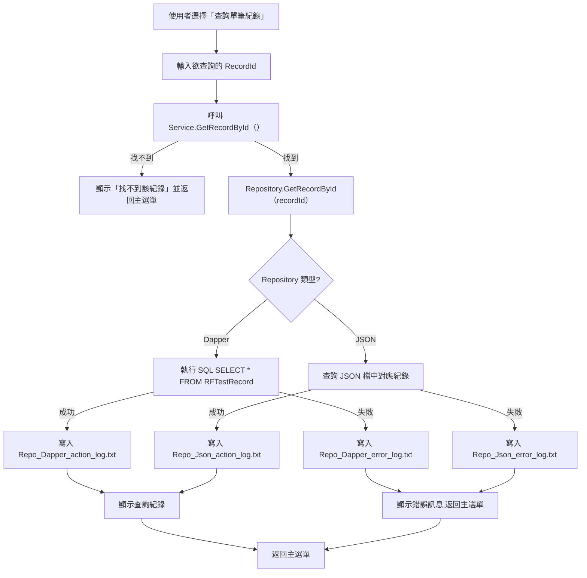
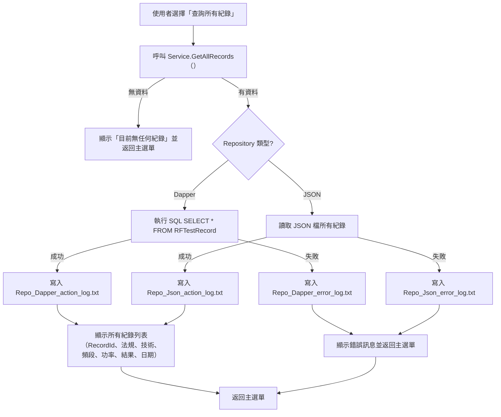
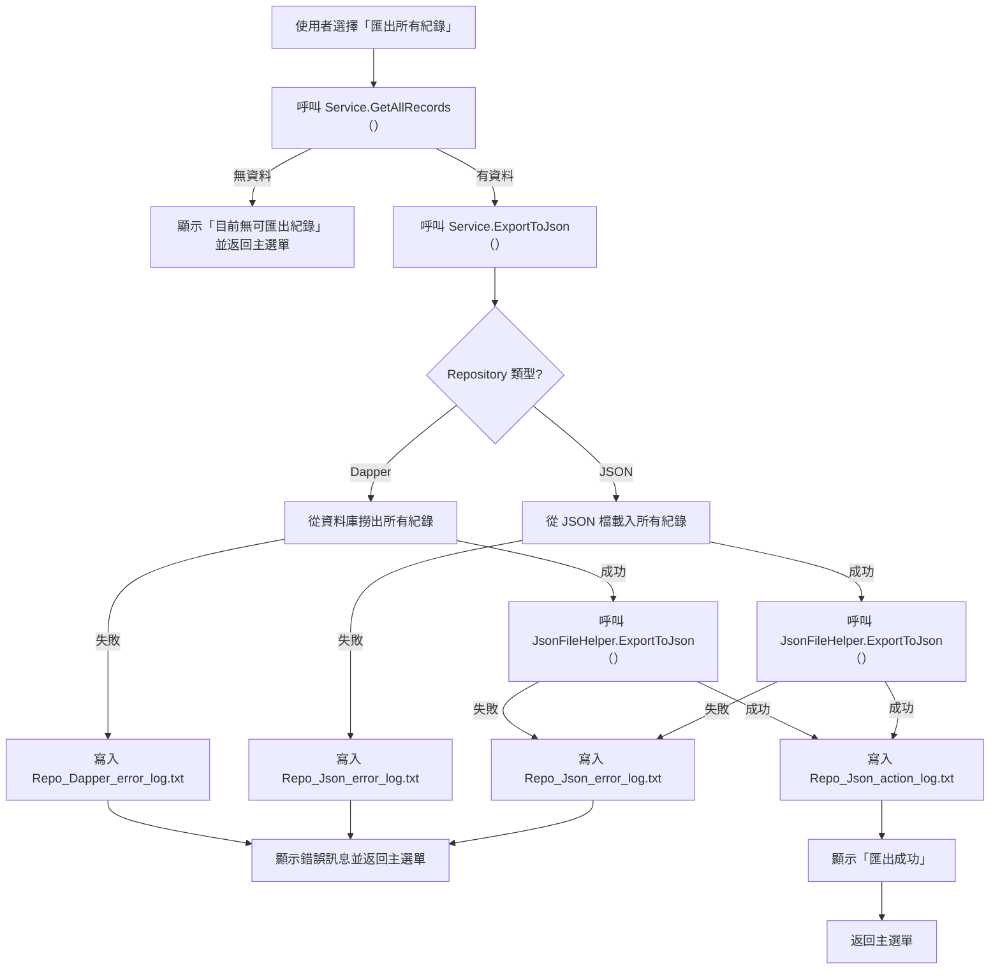
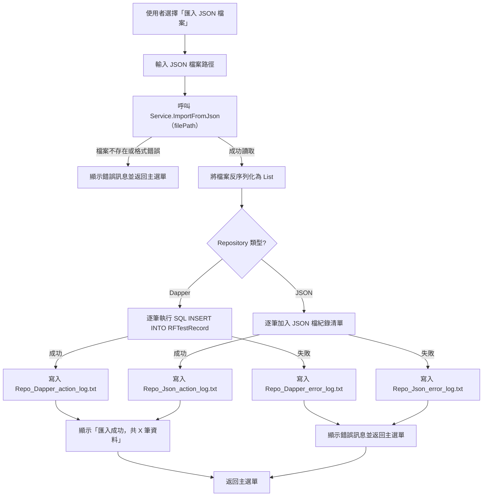
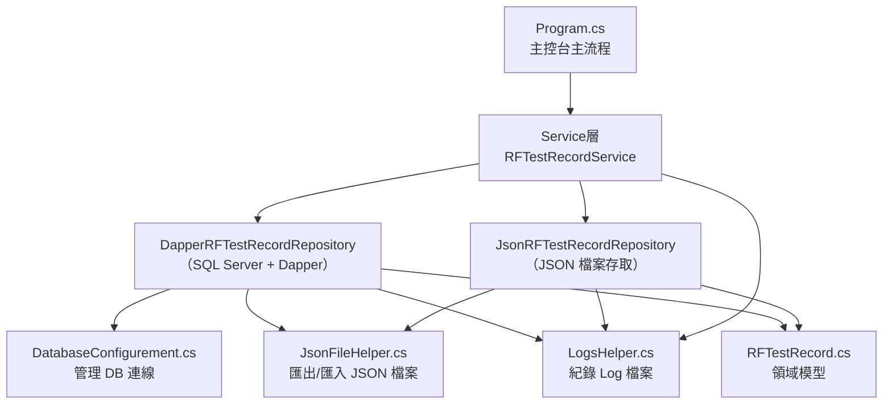

# RF測試紀錄管理系統(RFTestRecordManagement) 專案計畫

---

### 1. 專案名稱

**「RF測試紀錄管理系統」**

---

### 2. 專案目的

本專案旨在建立一個 **Console 應用程式**，模擬RF測試時可以記錄量測功率的法規、無線技術、

測試頻段、功率量測值、測試結果和測試時間。

#### 核心功能
- **RF測試紀錄：** 新增、更新、刪除、查詢所有資料、查詢單筆資料和關鍵字查詢測試紀錄。

#### 階段目標 (Minimum Viable Product, MVP)
- **階段 1：Repository建立**
目的：將資料庫 **Json** 與 **SQL Server** 建立出來，方便資料儲存與匯出。
技術重點：練習 **Json** 與 **Dapper(ORM)** 的設計。

- **階段 2：RF測試紀錄管理**
目的：建立RF測試紀錄的 CRUD 功能 (新增、更新、刪除和查詢)。
技術重點：練習 **分層架構** 與 **資料存取分離** 的設計。
  
- **階段 3：單元測試**
目的： 驗證最小單位程式碼是否能正確運作預期的功能。
技術重點：練習 **xUnit測試架構** 與 **Moq模擬物件** 的功能。

---

### 3. 流程分析 (Use Case / 流程細節)

#### 主要流程
  


#### 流程細節
新增紀錄


更新紀錄

```mermaid
graph TD
    A[使用者選擇「更新測試紀錄」] --> B[輸入欲更新的 RecordId]
    B --> C[呼叫 Service.GetRecordById（）]
    C -->|找不到| D[顯示「找不到該紀錄」並返回主選單]
    C -->|找到| E[顯示原始資料]
    E --> F[輸入新法規、技術、頻段、功率、結果、日期]
    F --> G[確認是否更新（Y/N）]
    G -->|N| H[取消操作返回主選單]
    G -->|Y| I[呼叫 Service.UpdateRecord（）]
    I --> J[驗證輸入]
    J -->|通過| K[Repository.UpdateRecord（record）]
    J -->|失敗| L[顯示錯誤訊息返回主選單]
    K --> M{Repository 類型?}
    M -->|Dapper| N1[執行 SQL UPDATE 指令]
    M -->|JSON| N2[更新 JSON 檔中對應紀錄]
    N1 -->|成功| O1[寫入 Repo_Dapper_action_log.txt]
    N1 -->|失敗| O2[寫入 Repo_Dapper_error_log.txt]
    N2 -->|成功| O3[寫入 Repo_Json_action_log.txt]
    N2 -->|失敗| O4[寫入 Repo_Json_error_log.txt]
    O1 --> P1[顯示更新成功]
    O2 --> P2[顯示錯誤訊息,返回主選單]
    O3 --> P1[顯示更新成功]
    O4 --> P2[顯示錯誤訊息,返回主選單]
    P1 --> Q[返回主選單]
    P2 --> Q
 ```

刪除紀錄

```mermaid
graph TD
    A[使用者選擇「刪除測試紀錄」] --> B[輸入欲刪除的 RecordId]
    B --> C[呼叫 Service.GetRecordById（）]
    C -->|找不到| D[顯示「找不到該紀錄」並返回主選單]
    C -->|找到| E[顯示原始資料]
    E -->F[確認是否刪除（Y/N）]
    F -->|N| G[取消操作返回主選單]
    F -->|Y| H[呼叫 Service.DeleteRecord（）]
    H -->I[驗證輸入]
    I -->|通過| J[Repository.DeleteRecord（recordId）]
    I -->|失敗| K[顯示錯誤訊息返回主選單]
    J -->L{Repository 類型?}
    L -->|Dapper| M1[執行 SQL DELETE 指令]
    L -->|JSON| M2[刪除 JSON 檔中對應紀錄]
    M1 -->|成功| N1[寫入 Repo_Dapper_action_log.txt]
    M1 -->|失敗| N2[寫入 Repo_Dapper_error_log.txt]
    M2 -->|成功| N3[寫入 Repo_Json_action_log.txt]
    M2 -->|失敗| N4[寫入 Repo_Json_error_log.txt]
    N1 --> O1[顯示刪除成功]
    N2 --> O2[顯示錯誤訊息,返回主選單]
    N3 --> O1[顯示刪除成功]
    N4 --> O2[顯示錯誤訊息,返回主選單]
    O1 --> P[返回主選單]
    O2 --> P
```

查詢單筆紀錄



查詢所有紀錄



匯出所有紀錄至 JSON 檔案



匯入 JSON 檔案置資料庫



---

### 4. 程式架構設計 (分層式架構)

* **Presentation Layer (UI)** ：Console 負責輸入輸出、顯示介面

* **Business Logic Layer (Service)**：商業邏輯、檢查輸入、流程控制

* **Data Access Layer (Repository)**：封裝資料存取邏輯 (SQL_Server / Json)

* **Utilities（工具層）**：匯出/匯入 JSON 檔案、建立與管理 logs 資料夾

* **Infrastructure Layer (DatabaseConfig)** ：負責資料庫連線與測試

* **Domain Models (Entity)**：負責資料結構定義

* **UnitTest**：驗證 Service 層邏輯

---

### 5. 應用技術
* 使用的程式語言 (C#)
* 使用的工具 (VS Studio 2022, .Net Framework 4.8)
* 資料存放方式 (SQL Server + Dapper(ORM) & JSON)
* 練習的觀念 
  * 分層架構、資料存取分離、例外處理
  * 依賴注入與介面設計、物件導向（封裝、多型、泛型）
  * LINQ、基礎SQL語法、基礎Dapper（ORM）資料庫操作
  * Json檔案操作、日期時間操作、logs日誌
  * 匯出/匯入 Json檔案、單元測試（Moq + xUnit）

---

### 6. 程式碼結構



---

### 7. 測試案例 (Test Cases)

|測試案例編號| 測試項目 | 測試輸入 | 預期結果 |
|--------------|---------|-----------|-----------|
|Test Case 01 | 新增紀錄 | 法規 = `null` / `""` /`" "` | 拋出`ArgumentException`|
|Test Case 02 | 新增紀錄 | 功率 > 50 or 功率 < -50  | 拋出`ArgumentOutOfRangeException`|
|Test Case 03 | 新增紀錄 | 功率未超出範圍時 | 不拋出`ArgumentOutOfRangeException` |
|Test Case 04 | 新增紀錄 | 測試日期超出範圍時 | 拋出`ArgumentOutOfRangeException` |
|Test Case 05 | 新增紀錄 | 測試日期等於預設值時 | 拋出`ArgumentOutOfRangeException` |
|Test Case 06 | 新增紀錄 | 當正確輸入時 | 應正確呼叫 `Repository.InsertRecord` 並正確設定欄位|
|Test Case 07 | 新增紀錄 | 在輸入驗證失敗時 | 不應呼叫 `Repository.InsertRecord`|

---

### 8. 學習心得

本週學習主題為：

* 「Dapper(ORM)」

* 「Json檔案匯入/匯出」

* 「Logs日誌」

* 「單元測試（Moq + xUnit）」
   
* 「Console_Mode顏色變更」

* 「Readme撰寫（使用Visual Code）」

過程中誤將 Repository 建立成 .Net 8.0版本，導致在撰寫 Service 層無法參考 Repository；

原本透過修改 Repository.csproj，將版本修正為.Net.FrameWork 4.8，但實際在UI層測試資料庫連線一直跑出 無法載入 DLL 'Microsoft.Data.SqlClient.SNI.x86.dll'；

最後發現是.Net.FrameWork 4.8 不支援 Microsoft.Data.SqlClient，需要使用 System.Data.SqlClient;


   
